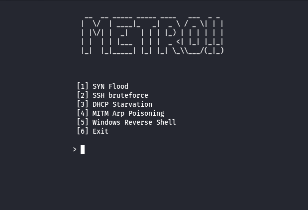

## Metro

Metro, named after the great Metro Boomin, is a bash script made to automate the process of testing a variety of simple attacks for an SIEM to detect.

## Installation
`git clone https://github.com/adot8/metro.git && cd metro`

`chmod +x setup.sh`

`sudo ./setup.sh`

### Usage
```bash
sudo ./metro.sh [-h] [-i interface]
-h		display help message
-i		interface
ex: sudo ./metro.sh -i eth0
```

